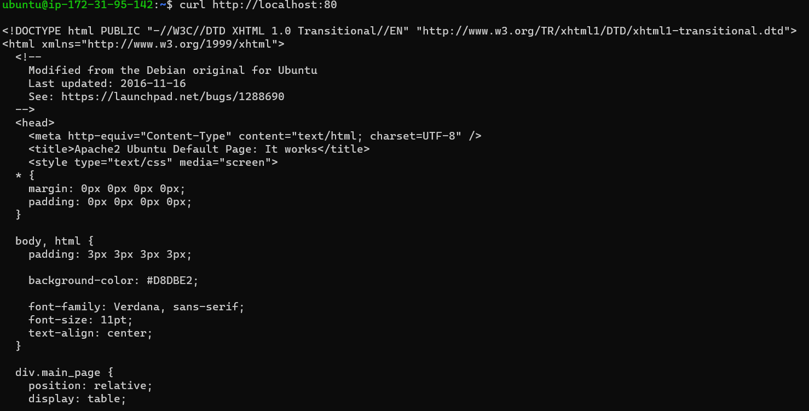
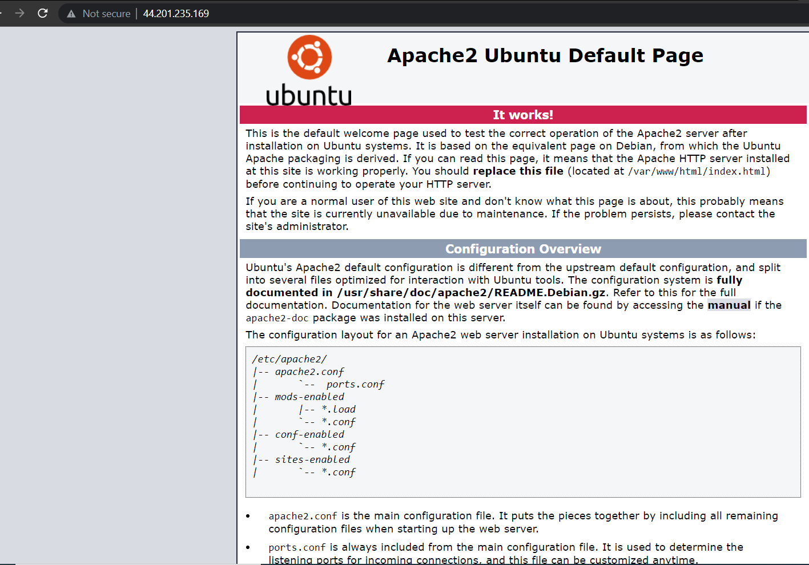

# Project 1 Documentation

___
 ### **TASK 1: INSTALLING APACHE AND UPDATING THE FIREWALL**
    
 ___
    I ran the following commands on my virtual machine to update a list of packages in the Ubuntu package manager, to install Apache and to verify that it is running as a service in my OS:

`sudo apt update`

`sudo apt install apache2`

`sudo systemctl status apache2`

The outcome is depicted in the image below:

A new rule to was then added to the EC2 configuration to open inbound connection through port 80, shown below:

Next, I checked that my Apache server can be accessed locally in my virtual machine. Upper part of the result is shown below:

The webserver is now accessible through the set firewall, as shown below:

___
 ### **TASK 2: INSTALLING MYSQL**
___

MySQL software was installed on my OS by running the following command:

`sudo apt install mysql-server`

The outcome is shown below

This step was immediately followed by running the secruity script. This was done with the command below, to which I responded with any other key besides 'Y':

`sudo mysql_secure_installation`

Thereafter, I logged in to the MySQL console by running this command:

`sudo mysql`

The outcome is shown below:

### **TASK 3: INSTALLING PHP**

I ran the command below to simultaneously install PHP, php-mysql and libapache2-mod-php:

`sudo apt install php php-mysql libapache2-mod-php`

Thereafter, the command below was used to check my PHP version:

`php -v`

The details of the insatlled PHP is displayed below:

-   [Project 1 Repository Link](https://github.com/sileola/Project-1)

### To be continued