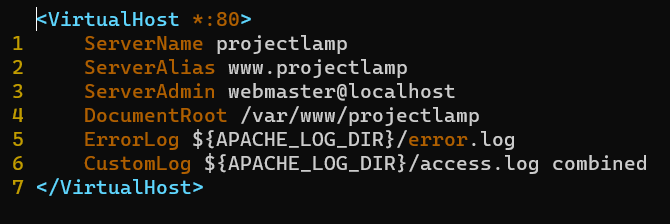

# Project 1 Documentation

___
 ### **TASK 1: INSTALLING APACHE AND UPDATING THE FIREWALL**
    
 ___
    I ran the following commands on my virtual machine to update a list of packages in the Ubuntu package manager, to install Apache and to verify that it is running as a service in my OS:


`sudo apt update`

`sudo apt install apache2`

`sudo systemctl status apache2`

The outcome is depicted in the image below:


A new rule to was then added to the EC2 configuration to open inbound connection through port 80, shown below:


Next, I checked that my Apache server can be accessed locally in my virtual machine. Upper part of the result is shown below:


The webserver is now accessible through the set firewall, as shown below:


___
 ### **TASK 2: INSTALLING MYSQL**
___


MySQL software was installed on my OS by running the following command:

`sudo apt install mysql-server`

The outcome is shown below


This step was immediately followed by running the secruity script. This was done with the command below, to which I responded with any other key besides 'Y':

`sudo mysql_secure_installation`

Thereafter, I logged in to the MySQL console by running this command:

`sudo mysql`

The outcome is shown below:


___
### **TASK 3: INSTALLING PHP**
___

I ran the command below to simultaneously install PHP, php-mysql and libapache2-mod-php:

`sudo apt install php php-mysql libapache2-mod-php`

Thereafter, the command below was used to check my PHP version:

`php -v`

The details of the insatlled PHP is displayed below:


___
### **TASK 4: CREATING A VIRTUAL HOST FOR A WEBSITE USING APACHE**
___

The following were the commands run:

`sudo mkdir /var/www/projectlamp`

`  sudo chown -R $USER:$USER /var/www/projectlamp`

Then, I created and opened, using Vim, a new configuration file in Apache’s sites-available directory. I named it projectlamp.conf. Thereafrer, I pasted the following text in the opened file:



I ran the following command to complete my configuration:

`sudo a2ensite projectlamp`
`sudo a2dissite 000-default`
`sudo apache2ctl configtest`
`sudo systemctl reload apache2`

I created an index.html file in the web root using this command:

`sudo echo 'Hello LAMP from hostname' $(curl -s http://169.254.169.254/latest/meta-data/public-hostname) 'with public IP' $(curl -s http://169.254.169.254/latest/meta-data/public-ipv4) > /var/www/projectlamp/index.html`


From from browser, I opened my website URL and the result returned is shown below:


___
### **TASK 5: ENABLE PHP ON THE WEBSITE**
---
I ran the following commands:

`sudo vim /etc/apache2/mods-enabled/dir.conf`

`sudo systemctl reload apache2`

After this, I created a new file named index.php inside the custom web root folder using the command:

`vim /var/www/projectlamp/index.php` and I opened the file and pasted in the text below:

```
<?php
phpinfo();
```

Saving and reloading the page on my browser gave the following output:


The page above was then removed by running this command:

`sudo rm /var/www/projectlamp/index.php`

## **This is the end of Project 1.**
