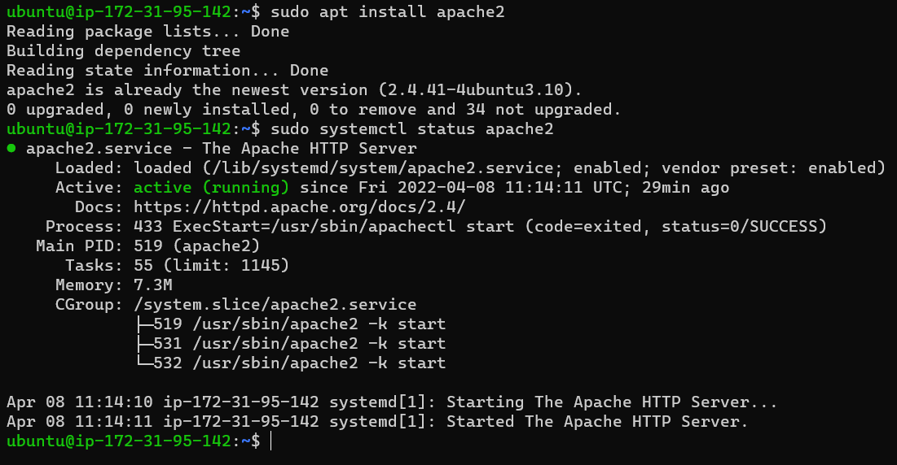

# Project 1 Documentation

### I ran the following commands on my virtual machine to update a list of packages in the Ubuntu package manager, install Apache and to verify that it is running as a service in my OS:

`sudo apt update`

`sudo apt install apache2`

`sudo systemctl status apache2`

### The outcome is depicted in the image below:

### To be continued